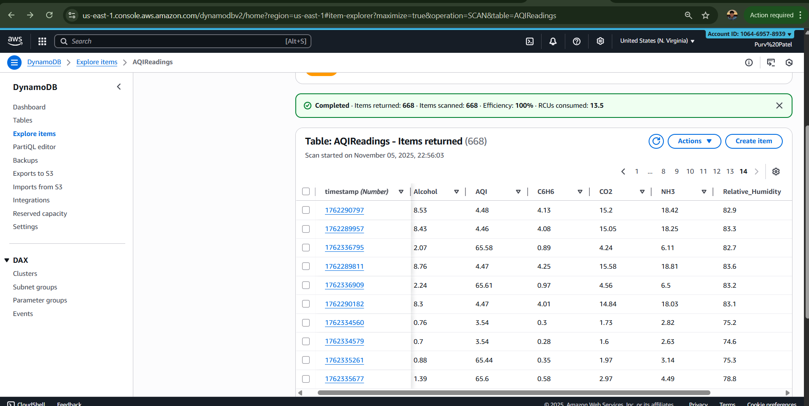
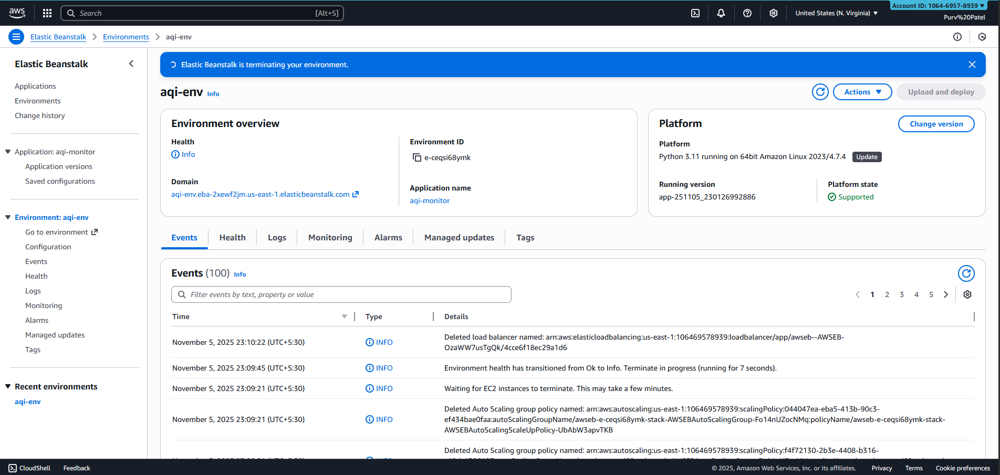
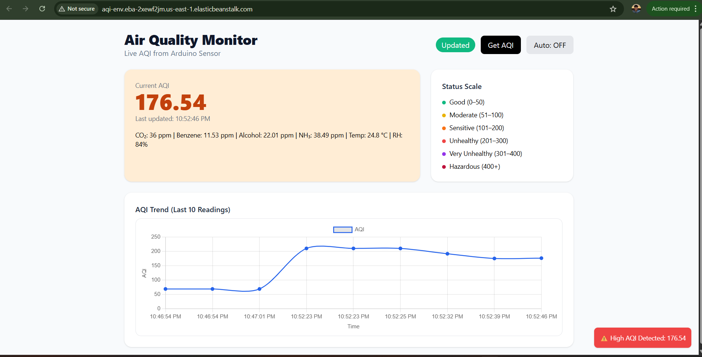

# 🌍 Air Quality Index (AQI) Monitoring & Prediction System  


A real-time Air Quality Index (AQI) monitoring web app powered by **Flask**, **Machine Learning**, and **AWS Cloud**.  
It fetches live sensor data (MQ135 + DHT22) from **Arduino UNO**, predicts AQI using a **Random Forest model**, and displays results with live charts.

---

## 🚀 Key Features
- Real-time AQI prediction using a trained Random Forest Regressor  
- Live data ingestion from Arduino (MQ135 + DHT22)  
- Data stored in **AWS DynamoDB** for persistence  
- Deployed on **AWS Elastic Beanstalk** (EC2 backend)  
- Secure IAM roles for deployment & service access  
- Responsive web UI with live AQI updates and graph trends  

---

## 🏗️ System Architecture

```text
+-------------------+       +----------------+        +--------------------+
|   Arduino (MQ135, | ----> |  Flask Backend | -----> |  DynamoDB (AWS)    |
|   DHT22 Sensors)  |       | (application.py)        |  Data Storage       |
+-------------------+       +----------------+        +--------------------+
           |                            |                       |
           |                            v                       v
           |                    Machine Learning Model      AWS Cloud Console
           |                    (RandomForest - aqi_model.pkl)
           |
           v
     Web Dashboard (Elastic Beanstalk)
```

---

## 🧠 Machine Learning Model

- **Algorithm:** Random Forest Regressor  
- **Dataset:** `AQI_dataset.csv`  
- **Trained model:** `aqi_model.pkl`  
- **Training script:** `train.ipynb`  
- Predicts AQI from features: CO₂, NH₃, Benzene, Alcohol, Temperature, and Humidity  

---

## ⚙️ AWS Cloud Setup

### Services Used
| AWS Service | Purpose |
|--------------|----------|
| **Elastic Beanstalk (EC2)** | Hosts Flask web app |
| **DynamoDB** | Stores real-time AQI readings |
| **IAM** | Defines secure roles for EC2, Elastic Beanstalk, and CLI access |
| **CloudWatch** | Monitors logs and health metrics |

### IAM Configuration
- User: `aws-cli-user`
- Roles:  
  - `aws-elasticbeanstalk-service-role`  
  - `aws-elasticbeanstalk-ec2-role`  
- Permissions: DynamoDB, S3, CloudWatch, ElasticBeanstalk full access

### Deployment Steps
```bash
# Initialize Elastic Beanstalk app
eb init -p python-3.11 aqi-monitor

# Create environment
eb create aqi-env

# Deploy updated version
eb deploy

# Open application in browser
eb open
```

**Procfile**
```bash
web: python application.py
```

---

## 🧩 Project Structure

```bash
aqi_app/
│
├── application.py         # Flask backend
├── predict_serial.py      # Reads Arduino serial data
├── aqi_model.pkl          # Pretrained ML model
├── AQI_dataset.csv        # Dataset for training
├── templates/             # Frontend templates (HTML + JS + Chart.js)
├── requirements.txt       # Dependencies list
├── Procfile               # Heroku/AWS deployment config
├── Arduino/               # Arduino UNO code
└── README.md              # Documentation
```

---

## ⚡ Arduino Hardware Setup

| Component | Description |
|------------|-------------|
| **Arduino UNO** | Microcontroller board |
| **MQ135 Sensor** | Measures harmful gases (CO₂, NH₃, Benzene) |
| **DHT22 Sensor** | Measures temperature and humidity |
| **Jumper wires, Breadboard, USB cable** | Circuit connections |

Pins:
- MQ135 → A0  
- DHT22 → D2 (data)  
- 5V & GND connections accordingly

📺 *Refer YouTube tutorials for complete circuit and calibration.*

---

<!-- ## 💻 Local Setup

1. Clone the repository  
   ```bash
   git clone https://github.com/<your-username>/aqi_monitor.git
   cd aqi_monitor
   ```

2. Create virtual environment  
   ```bash
   python -m venv venv
   venv\Scripts\activate
   ```

3. Install dependencies  
   ```bash
   pip install -r requirements.txt
   ```

4. Run application  
   ```bash
   python application.py
   ```

Access the dashboard at `http://127.0.0.1:5000`. -->

<!-- --- -->

## 🌐 Live AWS Deployment Demo

**Hosted on:** [Elastic Beanstalk Environment URL](http://aqi-env.eba-2xewf2jm.us-east-1.elasticbeanstalk.com) 

Example dashboard:  
- Displays **live AQI value**  
- Shows **trend graph of last 10 readings**  
- Status scale: Good → Hazardous  

Screenshots:  





---

## 🧰 Requirements

```
Flask==3.0.0
boto3
pandas
numpy
scikit-learn
pyserial
```

---

## 📊 Sample Output

| Timestamp | AQI  | CO₂ | NH₃ | Alcohol | Temp (°C) | RH (%) |
|------------|------|------|------|----------|------------|---------|
| 1762236795 | 65.5 | 15.2 | 18.4 | 8.7 | 25.0 | 83.1 |
| 1762335210 | 139.2 | 25 | 28.4 | 14.9 | 25.0 | 83 |

---

## 🧾 Results

✅ Successfully deployed Flask app via **AWS Elastic Beanstalk**  
✅ Data stored and retrieved using **DynamoDB**  
✅ Real-time AQI prediction displayed dynamically  
✅ Integrated **Arduino hardware sensors** for live readings  

---

## 🧠 Future Enhancements

- Integrate **AWS IoT Core** for direct device communication  
- Add **historical graph visualization** using AWS QuickSight  
- Enable **email/SMS alerts** for unhealthy AQI levels  

---

## 🧑‍💻 Author

**Purv Patel**  
📧 [patelpurv908@gmail.com]  
🔗 [LinkedIn](https://www.linkedin.com/in/purv-patel-b31a84280/) | [GitHub](https://github.com/Purv007)

---

> “Clean air is not a privilege, it’s a necessity. Let’s monitor it before it’s too late.”
